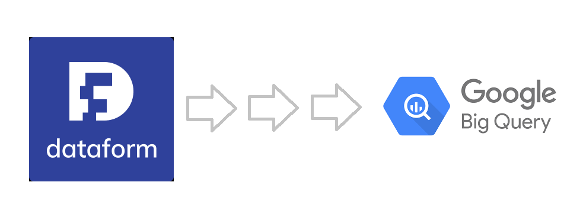

# GCP-Dataform



## Configurating your local development

mkdir scripts
mkdir data

sh download_data.sh

For more information about the dataset, go to https://files.grouplens.org/datasets/movielens/ml-latest-small-README.html

## Create repository
Repositories contain a single Dataform project that can be connected to your Git provider. Within a repository you can create workspaces for development and execute your SQL workflows against BigQuery.

New repositories start empty and can be connected to a git provider after being created.

ℹ Dataform will execute workflows as the service account service-[PROJECT_NUMBER]]@gcp-sa-dataform.iam.gserviceaccount.com. Ensure that the service account has been granted the role roles/bigquery.user in order to create datasets, tables and jobs. Also ensure that the service account has been granted access to read any datasets or tables that your workflow will consume.

## Create Development Workspace

Development workspaces contain an editable copy of your team's repository. Using development workspaces, you can develop code without affecting other users, commit changes, and push commits to your remote Git repository. If your repository is connected to a remote Git provider, changes from your development workspace will be pushed to a remote branch named after your development workspace. Otherwise, your changes will be pushed to your default branch.

## Initialize your Dataform workspace

This appears to be an empty Dataform workspace. To start developing with Dataform, first initialize your project with the required configuration files.

## Initialize your Dataform workspace

To start developing with Dataform, first initialize your project with the required configuration files.

## Connect a Dataform repository

To link a Dataform repository to a remote Git repository, follow these steps:

1. In the Google Cloud console, go to the Dataform page.
2. Select the repository you want to connect.
3. On the repository page, click *Settings > Connect with Git*.
4. In the *Link to remote repository* pane, in the *Remote Git repository URL* field, enter the URL of the remote Git repository, ending with .git.

    For HTTPS authentication, the URL of the remote Git repository cannot contain usernames or passwords.

    For SSH authentication, the URL of the remote Git repository be in one of the following formats:

    - Absolute URL: `ssh://git@{host_name}[:{port}]/{repository_path}`, `port`` is optional.
    - SCP-like URL: `git@{host_name}:{repository_path}`.

5. In the *Default remote branch name* field, enter the name of the main development branch of the remote Git repository.
6. In the *Secret* drop-down, select your secret for the remote Git repository.
7. If you used SSH authentication for the remote repository, in the *SSH public host key value* field, enter a single public host key of your Git provider.

The SSH public host key value must be in the format of a `known_hosts` file. The value must contain an algorithm and a public key encoded in the `base64` format, but without the hostname or IP, in the following format:

```
ALGORITHM BASE64_KEY_VALUE
```

For the Azure DevOps Services public host key, see [Use SSH key authentication](https://learn.microsoft.com/en-us/azure/devops/repos/git/use-ssh-keys-to-authenticate?view=azure-devops).

For the Bitbucket public host key, see [Configure SSH](https://support.atlassian.com/bitbucket-cloud/docs/configure-ssh-and-two-step-verification/).

For the GitHub public host key, see [GitHub's SSH key fingerprints](https://docs.github.com/en/authentication/keeping-your-account-and-data-secure/githubs-ssh-key-fingerprints).

For the GitLab public host key, see [SSH known_hosts entries](https://docs.gitlab.com/ee/user/gitlab_com/#ssh-known_hosts-entries).

8. Click Link.

ℹ Dataform needs a secret containing a personal access token (for HTTPS remotes) or a user private key (for SSH remotes) for connecting to your git provider. To proceed, create a secret in Secret Manager and grant roles/secretmanager.secretAccessor permissions to the default Dataform service account (service-[PROJECT_ID]@gcp-sa-dataform.iam.gserviceaccount.com).

